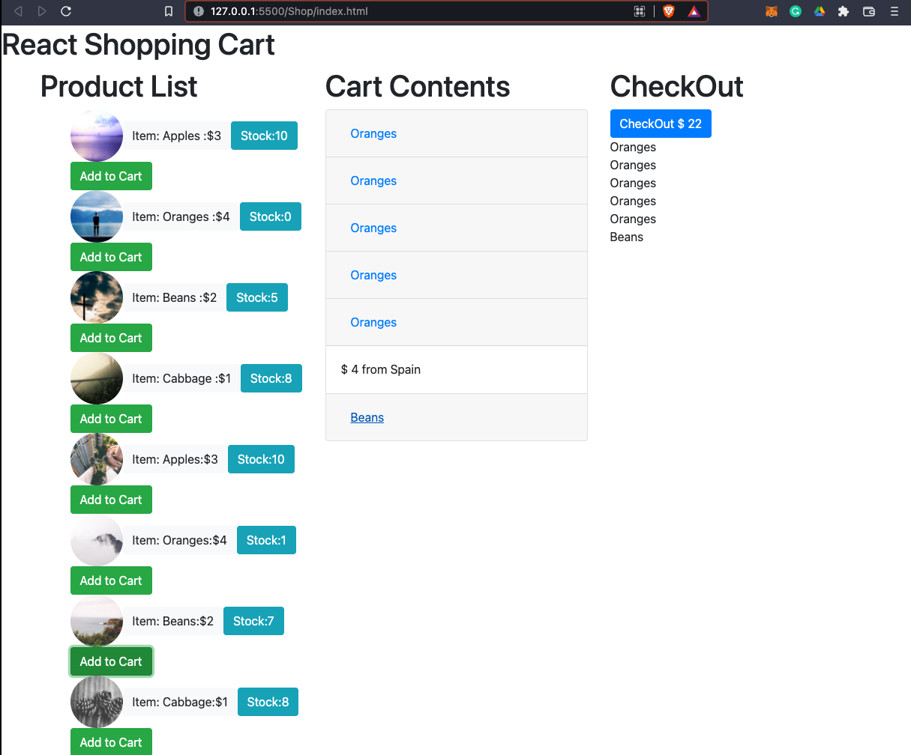

# Shopping-Cart
The Shopping-Cart Exercise was created for MITxPro full-stack web development program.  

<a href="https://foreverphoenix21.github.io/Shopping-cart/">
   </a
>

## Description:

 The Shopping-Cart Exercise is a project that uses React and Strapi to create, fetch and render data. 

## Installation:

 Upload the HTML file to your browser or fork and clone the project saving the files to your local hard drive. 
 

You can also run the program by running a strapi in the cartDB folder by entering "npm run develop" in commandline. 

## Usage:

 This exercise was made to demonstrate how strapi and React work together by fetching and rendering data.

## Roadmap:

*
 This exercise will continually be built and improved on as I learn additional skills in Javascript. 
*

***

**
 Future updates: 
**
- Update styling by using boostrap
- Create a delete button for each item on the list 
- seperate my fucntions into parent and child components

## Support:

 Want to share feedback or comments?

 
  
  Reach me on *[Linkedin](https://www.linkedin.com/in/derek-diaz/)* or *[Twitter](https://twitter.com/diazcsu).*
  

